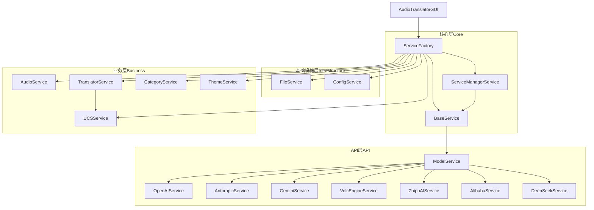

# 音频文件翻译器 (Audio Translator)

音频文件翻译器是一个功能强大的桌面应用程序，旨在帮助用户管理、分类和翻译音频文件。该应用程序集成了多种大型语言模型服务，支持高效的音频处理和文本生成功能。

## 功能特点

- **简洁直观的用户界面**：基于Tkinter构建的现代化界面，支持标签页式导航
- **文件管理**：浏览、选择和组织音频文件
- **文件分类**：手动或自动对音频文件进行分类
- **服务管理**：集成和管理多种AI服务提供商
- **多服务支持**：支持OpenAI、Anthropic（Claude）、Google Gemini、火山引擎、智谱AI、阿里云百炼和DeepSeek等服务
- **服务测试**：测试服务连接和功能
- **配置保存**：自动保存服务配置，实现便捷的重复使用
- **音频处理**：支持多种格式的音频文件处理和转换
- **翻译服务**：利用AI模型进行高质量的音频内容翻译

## 系统要求

- Python 3.8+
- 适用于Windows、macOS和Linux平台
- 音频处理库：ffmpeg（需要单独安装）

## 安装指南

### 1. 克隆仓库

```bash
git clone https://github.com/username/audio-translator.git
cd audio-translator
```

### 2. 创建虚拟环境（推荐）

#### 使用venv（标准方式）

```bash
python -m venv venv
```

激活虚拟环境:
- Windows: `venv\Scripts\activate`
- macOS/Linux: `source venv/bin/activate`

#### 使用uv（更快的替代方案）

如果你已安装[uv](https://github.com/astral-sh/uv)，可以使用它来创建和管理虚拟环境：

```bash
# 创建虚拟环境
uv venv

# 激活虚拟环境
# Windows
.venv\Scripts\activate
# macOS/Linux
source .venv/bin/activate
```

### 3. 安装依赖

#### 使用pip

```bash
pip install -r requirements.txt
```

#### 使用uv（更快）

```bash
uv pip install -r requirements.txt
```

主要依赖项包括：
- tkinter (GUI库)
- openai, anthropic, google-generativeai (AI服务API)
- requests (HTTP请求)
- pydub (音频处理)
- numpy, pandas (数据处理)
- pillow (图像处理)

### 4. 运行应用程序

```bash
python -m src.audio_translator
```

## 使用指南

### 主界面

应用程序启动后，您将看到两个主要选项卡：

1. **文件管理** - 用于浏览、选择和分类音频文件
2. **服务管理** - 用于配置和管理AI服务提供商

### 文件管理

1. 点击"打开目录"按钮浏览音频文件
2. 在文件树中选择要处理的文件
3. 使用右键菜单或工具栏按钮对文件进行分类
4. 双击文件可查看详细信息
5. 选择文件后，可以进行音频处理或翻译操作

### 服务管理

1. 切换到"服务管理"选项卡
2. 查看已配置的服务列表
3. 点击"添加服务"按钮添加新服务
4. 在表单中填写服务配置信息：
   - 服务名称
   - 服务类型（从下拉菜单中选择）
   - API密钥
   - API URL（可选，大多数服务有默认值）
5. 点击"保存"按钮保存服务配置
6. 使用"测试连接"按钮验证服务配置

### 支持的服务类型

应用程序支持以下AI服务提供商：

| 服务名称 | 服务类型 | 默认API URL |
|---------|---------|------------|
| OpenAI | openai | https://api.openai.com/v1 |
| Anthropic | anthropic | https://api.anthropic.com |
| Google Gemini | gemini | https://generativelanguage.googleapis.com |
| 火山引擎 | volcengine | https://open.volcengineapi.com |
| 智谱AI | zhipuai | https://open.bigmodel.cn/api |
| 阿里云百炼 | alibaba | https://dashscope.aliyuncs.com |
| DeepSeek | deepseek | https://api.deepseek.com/v1 |
| 统一通信服务 | ucs | 根据配置文件设置 |

## 项目结构

```
audio-translator/
├── src/                        # 源代码目录
│   ├── audio_translator/       # 主包
│   │   ├── api/                # API接口
│   │   ├── config/             # 配置管理
│   │   ├── core/               # 核心功能
│   │   ├── data/               # 数据定义和处理
│   │   ├── gui/                # GUI相关代码
│   │   │   ├── dialogs/        # 对话框组件
│   │   │   ├── panels/         # 面板组件
│   │   │   └── main_window.py  # 主窗口
│   │   ├── managers/           # 管理器
│   │   │   ├── file_manager.py
│   │   │   └── category_manager.py
│   │   ├── services/           # 服务实现
│   │   │   ├── core/           # 核心服务
│   │   │   │   ├── base_service.py           # 服务基类
│   │   │   │   ├── service_factory.py        # 服务工厂
│   │   │   │   └── service_manager_service.py# 服务管理器
│   │   │   ├── api/            # API服务
│   │   │   │   ├── model_service.py          # 模型服务基类
│   │   │   │   └── providers/               # 服务提供商
│   │   │   │       ├── openai/              # OpenAI服务
│   │   │   │       ├── anthropic/           # Anthropic服务
│   │   │   │       ├── gemini/              # Gemini服务
│   │   │   │       ├── volc/                # 火山引擎服务
│   │   │   │       ├── zhipu/               # 智谱AI服务
│   │   │   │       ├── alibaba/             # 阿里云百炼服务
│   │   │   │       └── deepseek/            # DeepSeek服务
│   │   │   ├── infrastructure/  # 基础设施服务
│   │   │   │   ├── file_service.py          # 文件服务
│   │   │   │   └── config_service.py        # 配置服务
│   │   │   └── business/       # 业务服务
│   │   │       ├── audio_service.py         # 音频服务
│   │   │       ├── translator_service.py    # 翻译服务
│   │   │       ├── category_service.py      # 分类服务
│   │   │       ├── theme_service.py         # 主题服务
│   │   │       └── ucs/                    # 统一通信服务
│   │   │           └── ucs_service.py      # UCS实现
│   │   └── utils/              # 工具函数
│   └── __main__.py             # 程序入口
├── tests/                      # 测试目录
├── config.json                 # 全局配置文件
├── config.py                   # 配置模块
├── category_manager.py         # 类别管理器
├── service_manager.py          # 服务管理器
├── theme_manager.py            # 主题管理器
├── translator.py               # 翻译器
├── translator_gui.py           # GUI界面
└── README.md                   # 项目说明
```

## 架构设计

应用程序采用分层架构设计，主要组件分为四个层次：

- **核心层(Core)**: 提供基础架构和服务管理
- **API层(API)**: 负责与外部API服务集成
- **基础设施层(Infrastructure)**: 提供底层功能支持
- **业务层(Business)**: 实现核心业务逻辑



## 配置文件

应用程序使用JSON格式的配置文件管理设置、服务和其他参数。主要配置文件位于`src/config/`目录中。

### 服务配置文件示例

`services.json` 文件定义了可用的AI服务：

```json
{
    "services": {
        "zhipu": {
            "name": "智谱 AI",
            "type": "zhipuai", 
            "enabled": true,
            "api_key": "YOUR_ZHIPU_API_KEY",
            "api_url": "https://open.bigmodel.cn/api/paas/v4",
            "models": [
                {
                    "name": "chatglm_turbo",
                    "description": "ChatGLM Turbo"
                }
            ],
            "current_model": "chatglm_turbo"
        }
    }
}
```

### API密钥管理

API密钥管理有以下几种方式：

1. **直接修改配置文件**
   
   编辑 `src/config/services.json` 文件，替换占位符：
   
   ```json
   {
       "services": {
           "zhipu": {
               "name": "智谱 AI",
               "type": "zhipuai",
               "enabled": true,
               "api_key": "YOUR_ZHIPU_API_KEY",
               ...
           },
           ...
       }
   }
   ```

2. **使用环境变量**
   
   更推荐的方式是使用环境变量管理API密钥：
   
   - 创建一个 `.env` 文件在项目根目录：
     ```
     ZHIPU_API_KEY=your_api_key_here
     VOLC_API_KEY=your_api_key_here
     OPENAI_API_KEY=your_api_key_here
     ```
   
   - 然后在 `services.json` 中使用环境变量引用:
     ```json
     "api_key": "${ZHIPU_API_KEY}"
     ```

3. **使用GUI工具管理**
   
   应用程序提供了API密钥管理界面：
   - 打开应用，点击菜单 "工具" > "API密钥管理"
   - 选择服务，设置API密钥或关联环境变量
   - 点击"测试连接"以验证配置的正确性

> **重要安全提示**：
> - 不要将包含真实API密钥的文件提交到版本控制系统
> - 将 `.env` 文件添加到 `.gitignore`
> - 定期轮换API密钥
> - 使用带权限限制的API密钥

## 开发指南

### 添加新的服务支持

要添加新的服务支持，需要：

1. 创建新的服务类，继承自`ModelService`
2. 在`api/providers/`目录下创建新的提供商目录
3. 实现必要的方法：`test_connection`, `list_models`, `chat_completion`, `validate_config`
4. 在`service_manager_service.py`中注册新服务

示例：
```python
# 在api/providers/newservice/newservice_service.py

from ...model_service import ModelService
from typing import Dict, List, Any

class NewService(ModelService):
    def __init__(self, config: Dict):
        super().__init__(config)
        self.name = config.get('name', 'New Service')
        self.type = 'newservice'
        
    def test_connection(self) -> Dict[str, Any]:
        # 实现连接测试逻辑
        pass
        
    def list_models(self) -> List[str]:
        # 获取可用模型列表
        pass
        
    def chat_completion(self, messages: List[Dict], model: str = None) -> Dict:
        # 实现聊天完成功能
        pass
        
    def validate_config(self) -> Dict[str, Any]:
        # 验证配置有效性
        pass
```

然后在`core/service_manager_service.py`中：
```python
@staticmethod
def get_available_services() -> List[str]:
    return ['openai', 'anthropic', 'gemini', 'azure', 'volcengine', 'zhipuai', 
            'alibaba', 'deepseek', 'newservice']
    
@staticmethod
def get_service_class(service_type: str) -> type:
    service_classes = {
        'openai': OpenAIService,
        'anthropic': AnthropicService,
        'gemini': GeminiService,
        'azure': AzureOpenAIService,
        'volcengine': VolcEngineService,
        'zhipuai': ZhipuAIService,
        'alibaba': AlibabaService,
        'deepseek': DeepSeekService,
        'newservice': NewService
    }
    return service_classes.get(service_type)
```

### 自定义UI

UI组件基于Tkinter构建，可以通过修改`gui`目录下的文件来自定义外观和行为。

主要UI组件：
- **MainWindow**: 应用程序主窗口
- **ServiceManagerPanel**: 服务管理面板
- **FileManagerPanel**: 文件管理面板
- **ConfigDialog**: 配置对话框
- **CategorySelectionDialog**: 分类选择对话框

## 贡献指南

1. Fork项目
2. 创建功能分支 (`git checkout -b feature/amazing-feature`)
3. 提交更改 (`git commit -m 'Add some amazing feature'`)
4. 推送到分支 (`git push origin feature/amazing-feature`)
5. 创建Pull Request

## 问题反馈

如果您遇到任何问题或有建议，请通过以下方式提交：

1. 在GitHub上创建Issue
2. 发送邮件至项目维护者

## 许可证

该项目采用MIT许可证 - 详情请参阅LICENSE文件

## 鸣谢

- 感谢所有开源贡献者
- 部分设计参考了CherryHQ/cherry-studio项目
- 特别感谢各大AI服务提供商提供的API支持

## 功能亮点

### 自定义模型功能

音频翻译器现已支持添加自定义模型，使用户可以为每个AI服务添加自己的模型配置。主要功能包括：

1. **添加自定义模型**：在服务管理面板中，用户可以点击"添加自定义模型"按钮，填写模型名称、ID和其他参数来添加一个新的自定义模型。

2. **删除自定义模型**：右键点击模型下拉列表，可以通过上下文菜单删除已添加的自定义模型。

3. **自动保存**：自定义模型会自动保存到服务配置中，并在下次启动程序时自动加载。

4. **与API获取的模型共存**：自定义模型可以与从API获取的标准模型列表共存，并且在刷新模型列表时不会被覆盖。

这一功能使得用户可以更灵活地使用各种AI服务提供的模型，特别是那些尚未正式列入服务提供商API返回列表的新模型。

---

*本项目仍在积极开发中，欢迎贡献代码和提出建议。* 