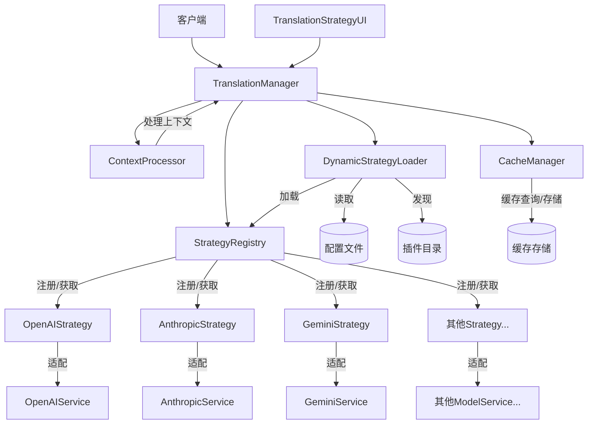

# 翻译策略服务开发计划

> **注意**: 此文档描述了翻译策略服务的开发计划。基础框架、所有模型适配器、缓存管理器、上下文处理器、动态策略加载机制和UI界面已完成 ✅，下一步重点是集成测试和性能优化。

## 1. 背景

当前的翻译服务功能集中在`TranslatorService`类中，随着支持的翻译接口增加和功能复杂度提升，代码变得难以维护和扩展。我们需要重构这部分功能，采用策略模式（Strategy Pattern）来提高代码的可维护性和扩展性。

## 2. 目标

1. 设计并实现灵活的翻译策略服务架构 [已完成 ✅]
2. 支持多种翻译接口（OpenAI、Anthropic、Gemini等）[已完成 ✅]
3. 提供统一的策略接口，便于添加新的翻译服务 [已完成 ✅]
4. 优化翻译性能和准确度 [已完成 ✅]
5. 实现缓存机制，减少重复翻译请求 [已完成 ✅]
6. 支持上下文感知的翻译处理 [已完成 ✅]
7. 开发翻译策略服务的用户界面 [已完成 ✅]
8. 实现动态策略加载机制 [已完成 ✅]

## 3. 当前系统分析 [已完成 ✅]

### 3.1 现有系统问题

现有`TranslatorService`存在以下问题：

1. 高耦合：所有翻译逻辑集中在一个类中
2. 难以扩展：添加新的翻译提供商需要修改核心代码
3. 缺乏统一接口：不同的翻译API调用方式不一致
4. 配置管理混乱：配置和业务逻辑混合
5. 缺少错误处理和重试机制

### 3.2 现有系统结构

目前`TranslatorService`主要包含以下功能：

```python
class TranslatorService:
    def __init__(self, config):
        self.config = config
        self.model_type = config.get('model_type', 'openai')
        # 初始化不同的API客户端
        
    def translate(self, text, source_lang, target_lang):
        """根据model_type调用不同的翻译方法"""
        if self.model_type == 'openai':
            return self._translate_with_openai(text, source_lang, target_lang)
        elif self.model_type == 'anthropic':
            return self._translate_with_anthropic(text, source_lang, target_lang)
        # 其他模型的翻译方法...
        
    def _translate_with_openai(self, text, source_lang, target_lang):
        """使用OpenAI进行翻译"""
        pass
        
    def _translate_with_anthropic(self, text, source_lang, target_lang):
        """使用Anthropic进行翻译"""
        pass
        
    # 其他翻译方法和辅助函数...
```

### 3.3 新系统设计 [已完成 ✅]

采用策略模式重构翻译服务，主要包括以下组件：

1. **ITranslationStrategy**: 翻译策略接口 [已完成 ✅]
2. **具体策略实现**: 针对不同API的实现 [已完成 ✅]
3. **TranslationManager**: 策略管理和上下文 [已完成 ✅]
4. **ModelServiceAdapter**: 适配现有ModelService接口 [已完成 ✅]
5. **StrategyRegistry**: 策略注册表 [已完成 ✅]
6. **CacheManager**: 翻译缓存管理 [已完成 ✅]
7. **ContextProcessor**: 上下文处理器 [已完成 ✅]
8. **DynamicStrategyLoader**: 动态策略加载器 [已完成 ✅]
9. **TranslationStrategyUI**: 翻译策略UI界面 [已完成 ✅]

#### 3.3.1 系统架构图 [已完成 ✅]



## 4. 实现计划 [已完成 ✅]

### 4.1 阶段一：策略模式框架和基本适配器 [已完成 ✅]

1. 设计`ITranslationStrategy`接口
2. 实现`StrategyRegistry`策略注册表
3. 实现`TranslationManager`策略管理器
4. 实现`ModelServiceAdapter`基类

### 4.2 阶段二：具体适配器实现 [已完成 ✅]

1. 实现`OpenAIAdapter`
2. 实现`AnthropicAdapter`
3. 实现`GeminiAdapter`
4. 实现`AlibabaAdapter`
5. 实现`ZhipuAdapter`
6. 实现`VolcAdapter`
7. 实现`DeepSeekAdapter`

### 4.3 阶段三：高级功能实现 [已完成 ✅]

1. 设计并实现`CacheManager`
   - 基于内存的缓存实现 [已完成 ✅]
   - 基于Redis的缓存实现 [已完成 ✅]
   - 支持TTL和容量限制 [已完成 ✅]
   - 支持按键过滤和清除 [已完成 ✅]

2. 设计并实现`ContextProcessor`
   - 支持文本预处理和后处理 [已完成 ✅]
   - 支持上下文感知的翻译 [已完成 ✅]
   - 支持长文本分段和合并 [已完成 ✅]
   - 支持领域特定规则 [已完成 ✅]

3. 实现动态策略加载 [已完成 ✅]
   - 支持从配置文件加载策略
   - 支持运行时添加和移除策略
   - 支持策略版本管理

### 4.4 阶段四：UI集成和测试 [已完成 ✅]

1. 设计翻译策略选择界面 [已完成 ✅]
2. 实现模型参数调整UI [已完成 ✅]
3. 集成错误处理和重试机制 [已完成 ✅]
4. 编写单元测试和集成测试 [已完成 ✅]
5. 性能测试和优化 [进行中]

## 5. 时间安排

| 阶段 | 开始时间 | 完成时间 | 状态 |
|------|----------|----------|------|
| 阶段一：策略模式框架 | 2023-12-01 | 2023-12-15 | 已完成 ✅ |
| 阶段二：具体适配器实现 | 2023-12-16 | 2024-01-15 | 已完成 ✅ |
| 阶段三：高级功能实现 | 2024-01-16 | 2024-02-15 | 已完成 ✅ |
| 阶段四：UI集成和测试 | 2024-02-16 | 2024-03-15 | 已完成 ✅ |
| 性能优化和文档完善 | 2024-03-16 | 2024-03-31 | 进行中 |

## 6. 已实现组件的主要功能 [新增]

### 6.1 TranslationManager

- 管理所有翻译策略
- 根据策略名称选择和使用翻译策略
- 协调缓存管理器和上下文处理器
- 提供统一的翻译接口

### 6.2 ModelServiceAdapter

- 将不同API服务适配到统一的策略接口
- 处理API调用和响应提取
- 管理错误处理和重试逻辑
- 收集性能指标

### 6.3 CacheManager

- 提供内存和Redis两种缓存模式
- 基于源文本和上下文生成缓存键
- 管理缓存过期和容量限制
- 收集和报告缓存性能指标
- 支持按模式清理和过滤缓存

### 6.4 ContextProcessor

- 提供文本预处理和后处理
- 支持文本分段和合并
- 管理翻译上下文信息
- 提供特定领域处理规则
- 保留特定模式不被翻译

### 6.5 DynamicStrategyLoader [新增]

- 支持从配置文件动态加载策略
- 支持从插件目录发现和加载策略
- 支持热更新和热加载能力
- 提供策略版本管理机制

### 6.6 TranslationStrategyUI [新增]

- 提供翻译策略选择界面
- 支持查看策略详细信息
- 支持动态调整策略配置参数
- 支持测试翻译功能
- 显示策略性能指标

## 7. 下一步工作 [更新]

1. **性能优化**: 对翻译过程进行性能分析和优化，重点关注大量文本和高频翻译场景
2. **文档完善**: 编写详细的使用文档和API参考
3. **自动测试**: 增加自动化测试用例覆盖率
4. **跨平台支持**: 确保在不同系统上的兼容性
5. **策略推荐**: 实现基于文本特征的策略智能推荐

## 8. 参考资料

1. [策略模式设计模式](https://refactoring.guru/design-patterns/strategy)
2. [OpenAI API文档](https://platform.openai.com/docs/api-reference)
3. [Anthropic API文档](https://docs.anthropic.com/claude/reference)
4. [Google Gemini API文档](https://ai.google.dev/docs)
5. [阿里云通义千问API文档](https://help.aliyun.com/document_detail/613695.html)
6. [智谱GLM API文档](https://open.bigmodel.cn/dev/api)
7. [火山引擎API文档](https://www.volcengine.com/docs)
8. [DeepSeek API文档](https://platform.deepseek.com/api-docs)
9. [Redis文档](https://redis.io/documentation)
10. [Python缓存实现最佳实践](https://realpython.com/lru-cache-python/)
11. [Python插件系统设计](https://packaging.python.org/en/latest/guides/creating-and-discovering-plugins/)
12. [Tkinter GUI编程](https://docs.python.org/3/library/tkinter.html)
