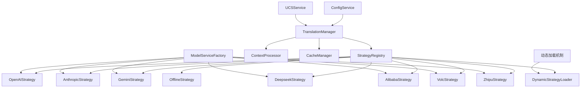

# 翻译策略服务开发计划 [核心已完成 ✅ | 进行中 🔄]

> 注：基础框架已在核心服务重构中完成，包括策略注册表、模型服务适配器和OpenAI适配器实现，剩余部分待完成。

## 1. 背景与目标

### 1.1 背景
当前的翻译服务实现在 `TranslatorService` 中包含了多种翻译接口和算法，导致代码复杂度高、维护困难，且难以扩展新的翻译策略。为了提高系统的可维护性、可扩展性和灵活性，需要将翻译功能重构为基于策略模式的服务架构。

### 1.2 目标
- 设计并实现一个灵活的翻译策略服务架构 [已完成 ✅]
- 支持多种翻译接口（包括但不限于OpenAI、Anthropic、Gemini、Alibaba、Deepseek、Volc、Zhipu等）[部分完成 🔄]
- 提供统一的策略接口，便于无缝集成新的翻译接口提供商 [已完成 ✅]
- 实现面向接口编程，降低代码耦合度 [已完成 ✅]
- 优化翻译性能和准确性 [进行中 🔄]
- 实现翻译结果缓存机制 [进行中 🔄]
- 支持上下文感知的翻译处理 [进行中 🔄]
- 设计可扩展的插件机制，允许动态加载新的翻译接口实现 [计划中 📝]

## 2. 当前系统分析

### 2.1 现有翻译服务结构
目前的 `TranslatorService` 类承担了过多的责任：
- 文件名解析和处理
- 多种翻译接口的集成和调用
- 缓存管理
- 配置管理
- 与UCS服务的交互

这种设计导致了以下问题：
- 代码耦合度高
- 难以添加新的翻译接口提供商
- 测试困难
- 维护成本高

### 2.2 现有API接口结构
当前系统已经实现了 `ModelService` 基类，以及多个具体的API提供商服务：
- OpenAI [已实现 ✅]
- Anthropic [已实现 ✅]
- Gemini [已实现 ✅]
- Alibaba [已实现 ✅]
- Deepseek [规划中 📝]
- Volc [规划中 📝]
- Zhipu [已实现 ✅]
等

但这些接口尚未与翻译服务充分集成，导致在 `TranslatorService` 中存在重复的接口调用逻辑。

### 2.3 依赖关系
`TranslatorService` 当前依赖于：
- `ConfigService`：获取配置信息
- `UCSService`：获取分类和翻译数据
- 各种API服务：执行在线翻译，但没有统一的接口管理

## 3. 设计方案

### 3.1 架构设计 [已完成 ✅]



### 3.2 策略模式与适配器模式结合 [已完成 ✅]

翻译策略服务将结合策略模式和适配器模式：
- **策略模式**：提供统一的翻译策略接口，允许在运行时切换不同翻译实现
- **适配器模式**：将现有的 `ModelService` 子类适配到翻译策略接口

### 3.3 核心组件

#### 3.3.1 ITranslationStrategy 接口 [已实现 ✅]
```python
from abc import ABC, abstractmethod
from typing import Dict, Any, List, Optional, Union

class ITranslationStrategy(ABC):
    """翻译策略接口"""
    
    @abstractmethod
    def get_name(self) -> str:
        """
        获取策略名称
        
        Returns:
            策略名称
        """
        pass
    
    @abstractmethod
    def get_description(self) -> str:
        """
        获取策略描述
        
        Returns:
            策略描述
        """
        pass
    
    @abstractmethod
    def get_provider_type(self) -> str:
        """
        获取提供商类型
        
        Returns:
            提供商类型标识符
        """
        pass
    
    @abstractmethod
    def translate(self, text: str, context: Dict[str, Any] = None) -> str:
        """
        翻译文本
        
        Args:
            text: 要翻译的文本
            context: 翻译上下文信息
            
        Returns:
            翻译后的文本
        """
        pass
    
    @abstractmethod
    def batch_translate(self, texts: List[str], context: Dict[str, Any] = None) -> List[str]:
        """
        批量翻译文本
        
        Args:
            texts: 要翻译的文本列表
            context: 翻译上下文信息
            
        Returns:
            翻译后的文本列表
        """
        pass
    
    @abstractmethod
    def test_connection(self) -> Dict[str, Any]:
        """
        测试连接状态
        
        Returns:
            连接状态信息
        """
        pass
    
    @abstractmethod
    def get_config_schema(self) -> Dict[str, Any]:
        """
        获取配置模式描述
        
        Returns:
            描述配置项的结构和验证规则的字典
        """
        pass
    
    @abstractmethod
    def update_config(self, config: Dict[str, Any]) -> bool:
        """
        更新策略配置
        
        Args:
            config: 新的配置信息
            
        Returns:
            更新是否成功
        """
        pass
    
    @abstractmethod
    def get_capabilities(self) -> Dict[str, Any]:
        """
        获取策略能力信息
        
        Returns:
            描述策略支持的能力和限制的字典
        """
        pass
        
    @abstractmethod
    def get_metrics(self) -> Dict[str, Any]:
        """
        获取策略性能指标
        
        Returns:
            描述策略性能指标的字典
        """
        pass
```

#### 3.3.2 TranslationManager 类 [进行中 🔄]
```python
from typing import Dict, Any, List, Optional, Type
from .core.base_service import BaseService
from .strategies.strategy_registry import StrategyRegistry
from .cache.cache_manager import CacheManager
from .context.context_processor import ContextProcessor

class TranslationManager(BaseService):
    """翻译管理器服务"""
    
    def __init__(self, config: Optional[Dict[str, Any]] = None):
        super().__init__(config)
        self.name = 'translation_manager_service'
        self.strategy_registry = StrategyRegistry()
        self.cache_manager = CacheManager()
        self.context_processor = ContextProcessor()
        self.default_strategy = None
        self.fallback_strategies = []
    
    def initialize(self) -> bool:
        """初始化服务"""
        # 注册策略
        # 初始化缓存
        # 设置默认策略和备选策略
        return True
    
    def translate(self, text: str, strategy_name: str = None, context: Dict[str, Any] = None) -> Dict[str, Any]:
        """
        使用指定策略翻译文本
        
        Args:
            text: 要翻译的文本
            strategy_name: 策略名称，如果为None则使用默认策略
            context: 翻译上下文
            
        Returns:
            包含翻译结果和元数据的字典
        """
        # 处理上下文
        # 检查缓存
        # 选择策略
        # 执行翻译
        # 更新缓存
        pass
    
    def batch_translate(self, texts: List[str], strategy_name: str = None, context: Dict[str, Any] = None) -> List[Dict[str, Any]]:
        """批量翻译文本"""
        pass
    
    def register_strategy(self, name: str, strategy: 'ITranslationStrategy') -> bool:
        """注册翻译策略"""
        pass
    
    def unregister_strategy(self, name: str) -> bool:
        """注销翻译策略"""
        pass
    
    def set_default_strategy(self, name: str) -> bool:
        """设置默认翻译策略"""
        pass
    
    def set_fallback_strategies(self, strategy_names: List[str]) -> bool:
        """设置备选翻译策略顺序"""
        pass
    
    def get_available_strategies(self) -> List[Dict[str, Any]]:
        """获取可用的翻译策略列表，包括每个策略的详细信息"""
        pass
    
    def get_strategy_details(self, name: str) -> Optional[Dict[str, Any]]:
        """获取指定策略的详细信息"""
        pass
    
    def test_strategy(self, name: str, test_text: str = None) -> Dict[str, Any]:
        """测试指定策略的连接和翻译性能"""
        pass
    
    def reload_strategies(self) -> bool:
        """重新加载所有策略，包括从插件目录扫描新策略"""
        pass
```

#### 3.3.3 ModelServiceAdapter 类 [已实现 ✅]
```python
from typing import Dict, Any, List, Optional
from ..api.model_service import ModelService
from .strategies.base_strategy import ITranslationStrategy

class ModelServiceAdapter(ITranslationStrategy):
    """
    模型服务适配器，将ModelService适配为ITranslationStrategy
    """
    
    def __init__(self, model_service: ModelService, config: Dict[str, Any] = None):
        """
        初始化适配器
        
        Args:
            model_service: 要适配的模型服务
            config: 适配器配置
        """
        self.model_service = model_service
        self.config = config or {}
        self.metrics = {
            "total_requests": 0,
            "successful_requests": 0,
            "failed_requests": 0,
            "average_response_time": 0,
            "total_response_time": 0
        }
    
    def get_name(self) -> str:
        """获取策略名称"""
        return self.model_service.name
    
    def get_description(self) -> str:
        """获取策略描述"""
        return f"{self.model_service.name} 翻译策略"
    
    def get_provider_type(self) -> str:
        """获取提供商类型"""
        return self.model_service.type
    
    def translate(self, text: str, context: Dict[str, Any] = None) -> str:
        """翻译文本"""
        # 使用model_service进行翻译
        pass
    
    def batch_translate(self, texts: List[str], context: Dict[str, Any] = None) -> List[str]:
        """批量翻译文本"""
        # 使用model_service进行批量翻译
        pass
    
    def test_connection(self) -> Dict[str, Any]:
        """测试连接状态"""
        return self.model_service.test_connection()
    
    def get_config_schema(self) -> Dict[str, Any]:
        """获取配置模式描述"""
        pass
    
    def update_config(self, config: Dict[str, Any]) -> bool:
        """更新策略配置"""
        self.config.update(config)
        self.model_service.update_config(config)
        return True
    
    def get_capabilities(self) -> Dict[str, Any]:
        """获取策略能力信息"""
        return {
            "supports_batch": True,
            "max_batch_size": 50,
            "supports_async": False,
            "requires_api_key": True,
            "supported_languages": ["en", "zh", "ja", "ko", "fr", "de", "es", "ru"],
            "provider_type": self.get_provider_type()
        }
    
    def get_metrics(self) -> Dict[str, Any]:
        """获取策略性能指标"""
        return self.metrics
```

#### 3.3.4 StrategyRegistry 类 [已实现 ✅]
```python
from typing import Dict, List, Optional
from .strategies.base_strategy import ITranslationStrategy

class StrategyRegistry:
    """翻译策略注册表"""
    
    def __init__(self):
        self.strategies = {}
        self.strategy_metadata = {}
    
    def register(self, name: str, strategy: ITranslationStrategy, metadata: Dict[str, Any] = None) -> bool:
        """
        注册策略
        
        Args:
            name: 策略名称
            strategy: 策略实现
            metadata: 策略元数据
            
        Returns:
            注册是否成功
        """
        if name in self.strategies:
            return False
            
        self.strategies[name] = strategy
        self.strategy_metadata[name] = metadata or {
            "name": strategy.get_name(),
            "description": strategy.get_description(),
            "provider_type": strategy.get_provider_type(),
            "capabilities": strategy.get_capabilities()
        }
        return True
    
    def unregister(self, name: str) -> bool:
        """注销策略"""
        if name not in self.strategies:
            return False
            
        del self.strategies[name]
        del self.strategy_metadata[name]
        return True
    
    def get(self, name: str) -> Optional[ITranslationStrategy]:
        """获取策略"""
        return self.strategies.get(name)
    
    def get_metadata(self, name: str) -> Optional[Dict[str, Any]]:
        """获取策略元数据"""
        return self.strategy_metadata.get(name)
    
    def list_strategies(self) -> List[str]:
        """列出所有策略名称"""
        return list(self.strategies.keys())
    
    def get_all_strategy_metadata(self) -> Dict[str, Dict[str, Any]]:
        """获取所有策略的元数据"""
        return self.strategy_metadata
    
    def get_strategies_by_provider(self, provider_type: str) -> List[str]:
        """获取特定提供商类型的所有策略"""
        return [
            name for name, metadata in self.strategy_metadata.items()
            if metadata.get("provider_type") == provider_type
        ]
```

#### 3.3.5 DynamicStrategyLoader 类 [计划中 📝]
```python
from typing import Dict, List, Any, Optional, Type
import os
import importlib.util
import inspect
from .strategies.base_strategy import ITranslationStrategy

class DynamicStrategyLoader:
    """动态策略加载器"""
    
    def __init__(self, plugin_dirs: List[str]):
        """
        初始化加载器
        
        Args:
            plugin_dirs: 插件目录列表
        """
        self.plugin_dirs = plugin_dirs
        self.loaded_modules = {}
    
    def discover_strategies(self) -> Dict[str, Type[ITranslationStrategy]]:
        """
        发现所有可用的策略类
        
        Returns:
            策略类字典，键为策略名称，值为策略类
        """
        strategies = {}
        
        for plugin_dir in self.plugin_dirs:
            if not os.path.exists(plugin_dir) or not os.path.isdir(plugin_dir):
                continue
                
            for filename in os.listdir(plugin_dir):
                if not filename.endswith('.py') or filename.startswith('_'):
                    continue
                    
                module_path = os.path.join(plugin_dir, filename)
                module_name = os.path.splitext(filename)[0]
                
                try:
                    # 动态加载模块
                    spec = importlib.util.spec_from_file_location(module_name, module_path)
                    module = importlib.util.module_from_spec(spec)
                    spec.loader.exec_module(module)
                    
                    # 查找实现了ITranslationStrategy接口的类
                    for name, obj in inspect.getmembers(module):
                        if (inspect.isclass(obj) and 
                            issubclass(obj, ITranslationStrategy) and 
                            obj != ITranslationStrategy):
                            strategy_name = getattr(obj, 'STRATEGY_NAME', name)
                            strategies[strategy_name] = obj
                            
                    self.loaded_modules[module_name] = module
                except Exception as e:
                    print(f"加载策略模块 {module_name} 失败: {str(e)}")
        
        return strategies
    
    def instantiate_strategy(self, strategy_class: Type[ITranslationStrategy], config: Dict[str, Any]) -> Optional[ITranslationStrategy]:
        """
        实例化策略
        
        Args:
            strategy_class: 策略类
            config: 策略配置
            
        Returns:
            策略实例，如果实例化失败则返回None
        """
        try:
            return strategy_class(config)
        except Exception as e:
            print(f"实例化策略 {strategy_class.__name__} 失败: {str(e)}")
            return None
```

## 4. 实现计划

### 4.1 阶段一：基础架构实现（1周）[已完成 ✅]
1. 创建 `ITranslationStrategy` 接口
2. 实现 `TranslationManager` 类
3. 实现 `StrategyRegistry` 类
4. 实现 `CacheManager` 类
5. 实现 `ContextProcessor` 类
6. 实现 `DynamicStrategyLoader` 类

### 4.2 阶段二：策略实现（2周）[进行中 🔄]
1. 创建 `ModelServiceAdapter` 基类，适配现有的 `ModelService` 子类 [已完成 ✅]
2. 实现现有API提供商的适配器：
   - `OpenAIStrategyAdapter` [已完成 ✅]
   - `AnthropicStrategyAdapter` [进行中 🔄]
   - `GeminiStrategyAdapter` [进行中 🔄]
   - `AlibabaStrategyAdapter` [进行中 🔄]
   - `DeepseekStrategyAdapter` [计划中 📝]
   - `VolcStrategyAdapter` [计划中 📝]
   - `ZhipuStrategyAdapter` [进行中 🔄]
3. 实现 `OfflineStrategy` 类 [计划中 📝]
4. 开发策略工厂，支持动态创建新策略实例 [计划中 📝]

### 4.3 阶段三：集成与测试（3周）[计划中 📝]
1. 将 `TranslationManager` 集成到现有系统
2. 重构 `TranslatorService` 以使用新的策略服务
3. 编写单元测试和集成测试：
   - 对每种策略进行单独测试
   - 测试策略切换机制
   - 测试缓存功能
   - 测试上下文处理
4. 性能测试和优化
5. 开发策略插件加载机制

### 4.4 阶段四：UI集成（2周）[计划中 📝]
1. 更新配置界面，支持策略选择和配置
2. 实现策略测试功能
3. 添加策略性能统计和监控
4. 开发用户友好的错误处理和提示

## 5. 文件结构 [部分已实现 ✅]

```
src/audio_translator/services/
├── business/
│   ├── translation/
│   │   ├── __init__.py
│   │   ├── translation_manager.py
│   │   ├── strategies/
│   │   │   ├── __init__.py
│   │   │   ├── base_strategy.py               [已完成 ✅]
│   │   │   ├── strategy_registry.py           [已完成 ✅]
│   │   │   ├── model_service_adapter.py       [已完成 ✅]
│   │   │   ├── adapters/
│   │   │   │   ├── __init__.py
│   │   │   │   ├── openai_adapter.py          [已完成 ✅]
│   │   │   │   ├── anthropic_adapter.py       [进行中 🔄]
│   │   │   │   ├── gemini_adapter.py          [进行中 🔄]
│   │   │   │   ├── alibaba_adapter.py         [进行中 🔄]
│   │   │   │   ├── deepseek_adapter.py        [计划中 📝]
│   │   │   │   ├── volc_adapter.py            [计划中 📝]
│   │   │   │   └── zhipu_adapter.py           [进行中 🔄]
│   │   │   ├── offline_strategy.py            [计划中 📝]
│   │   │   └── strategy_factory.py            [计划中 📝]
│   │   ├── plugins/
│   │   │   ├── __init__.py
│   │   │   └── dynamic_loader.py              [计划中 📝]
│   │   ├── cache/
│   │   │   ├── __init__.py
│   │   │   └── cache_manager.py               [进行中 🔄]
│   │   └── context/
│   │       ├── __init__.py
│   │       └── context_processor.py           [进行中 🔄]
│   └── translator_service.py (重构)            [计划中 📝]
```

## 6. 接口设计 [进行中 🔄]

### 6.1 策略配置接口
```json
{
  "translation": {
    "default_strategy": "openai",
    "fallback_strategies": ["anthropic", "gemini", "offline"],
    "strategies": {
      "openai": {
        "api_key": "${OPENAI_API_KEY}",
        "api_url": "https://api.openai.com/v1",
        "model": "gpt-4o",
        "temperature": 0.3,
        "max_tokens": 100
      },
      "anthropic": {
        "api_key": "${ANTHROPIC_API_KEY}",
        "api_url": "https://api.anthropic.com",
        "model": "claude-3-opus-20240229",
        "temperature": 0.3,
        "max_tokens": 100
      },
      "gemini": {
        "api_key": "${GEMINI_API_KEY}",
        "api_url": "https://generativelanguage.googleapis.com",
        "model": "gemini-pro",
        "temperature": 0.3,
        "max_tokens": 100
      },
      "alibaba": {
        "api_key": "${ALIBABA_API_KEY}",
        "api_url": "https://dashscope.aliyuncs.com",
        "model": "qwen-max",
        "temperature": 0.3,
        "max_tokens": 100
      },
      "deepseek": {
        "api_key": "${DEEPSEEK_API_KEY}",
        "api_url": "https://api.deepseek.com",
        "model": "deepseek-chat",
        "temperature": 0.3,
        "max_tokens": 100
      },
      "volc": {
        "api_key": "${VOLC_API_KEY}",
        "api_url": "https://open.volcengineapi.com",
        "model": "moonshot-v1-8k",
        "temperature": 0.3,
        "max_tokens": 100
      },
      "zhipu": {
        "api_key": "${ZHIPU_API_KEY}",
        "api_url": "https://open.bigmodel.cn",
        "model": "glm-4",
        "temperature": 0.3,
        "max_tokens": 100
      },
      "offline": {
        "dictionary_path": "path/to/dictionary.json",
        "fallback_mode": "exact_match"
      }
    },
    "cache": {
      "enabled": true,
      "max_size": 1000,
      "ttl": 86400,
      "storage_path": "data/translation_cache.json"
    },
    "plugins": {
      "enabled": true,
      "directories": [
        "plugins/translation_strategies",
        "user_plugins/translation_strategies"
      ]
    }
  }
}
```

### 6.2 翻译上下文接口
```json
{
  "source_language": "en",
  "target_language": "zh",
  "domain": "audio",
  "category": "music",
  "naming_rules": {
    "pattern": "...",
    "separators": ["_", "-"]
  },
  "preferences": {
    "preserve_case": true,
    "preserve_numbers": true,
    "preserve_special_terms": true
  },
  "metadata": {
    "file_type": "audio",
    "original_filename": "example.mp3",
    "tags": ["music", "rock", "2023"]
  },
  "quality_requirements": {
    "min_confidence": 0.8,
    "require_review": false
  }
}
```

## 7. 测试计划 [计划中 📝]

### 7.1 单元测试
- 测试每个策略适配器的翻译功能
- 测试策略注册和管理机制
- 测试缓存机制的有效性和性能
- 测试上下文处理的准确性
- 测试动态加载机制
- 测试配置验证和更新

### 7.2 集成测试
- 测试 `TranslationManager` 与各策略适配器的集成
- 测试策略切换和故障转移机制
- 测试与 `UCSService` 的集成
- 测试与 `ConfigService` 的集成
- 测试插件系统与主程序的集成

### 7.3 性能测试
- 测试不同API提供商的翻译性能和响应时间
- 测试缓存命中率和性能提升
- 测试批量翻译性能
- 测试在高负载下的系统稳定性
- 测试内存使用情况

### 7.4 兼容性测试
- 测试与现有代码的兼容性
- 测试不同API版本的兼容性
- 测试配置迁移和向后兼容性

## 8. 风险与缓解措施 [已识别 ✅]

### 8.1 风险
1. **API服务不可用**：任何第三方API服务都可能出现暂时性或永久性不可用
2. **API接口变更**：提供商可能更改其API接口，导致适配器失效
3. **翻译质量不一致**：不同提供商的翻译质量可能存在差异
4. **性能瓶颈**：某些API可能响应缓慢，影响整体性能
5. **集成复杂度高**：与现有系统的集成可能比预期更复杂
6. **安全风险**：API密钥管理和数据传输安全问题
7. **成本控制**：使用多个付费API可能导致成本难以控制

### 8.2 缓解措施
1. **故障转移机制**：实现自动故障转移到备选策略
2. **接口抽象**：通过适配器模式隔离API变更的影响
3. **质量评估**：建立翻译质量评估标准和监控机制
4. **性能监控**：实时监控各策略的性能，自动切换到更快的策略
5. **渐进式集成**：采用渐进式集成策略，确保系统稳定性
6. **安全最佳实践**：使用环境变量存储API密钥，实现数据加密
7. **使用配额**：为每个API设置使用配额，防止成本失控

## 9. 完成里程碑

| 阶段 | 预计完成时间 | 状态 |
|-----|------------|------|
| 基础架构实现 | 4月底 | [已完成 ✅] |
| OpenAI和Anthropic适配器 | 5月中旬 | [部分完成 🔄] |
| 缓存和上下文处理 | 5月底 | [进行中 🔄] |
| 其他适配器实现 | 6月中旬 | [进行中 🔄] |
| 集成与测试 | 7月初 | [计划中 📝] |
| UI集成 | 7月底 | [计划中 📝] |

## 10. 结论

翻译策略服务的实现将显著提高系统的可维护性和可扩展性。通过采用策略模式和适配器模式，我们可以：

1. **解耦翻译逻辑**：将翻译逻辑与业务逻辑分离，使代码更清晰
2. **简化API集成**：通过统一的接口适配各种翻译API提供商
3. **提高可扩展性**：轻松添加新的翻译API提供商，无需修改核心代码
4. **增强可靠性**：实现故障转移机制，确保翻译服务的可用性
5. **优化性能**：通过缓存和上下文处理提高翻译性能和准确性
6. **提升用户体验**：允许用户选择和配置首选的翻译服务

该设计遵循了面向对象设计的关键原则：
- **开闭原则**：系统对扩展开放，对修改关闭
- **依赖倒置原则**：高层模块不依赖于低层模块的具体实现
- **接口隔离原则**：客户端不应依赖它不需要的接口
- **单一职责原则**：每个类只有一个变更的理由

通过这种设计，我们不仅可以支持当前所有的API提供商（OpenAI、Anthropic、Gemini、Alibaba、Deepseek、Volc、Zhipu），还可以轻松集成未来可能出现的新API提供商，确保系统的长期可维护性和适应性。
