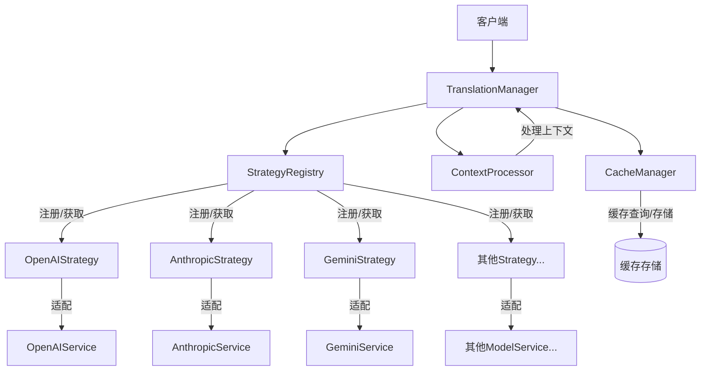

# 翻译策略服务开发计划

> **注意**: 此文档描述了翻译策略服务的开发计划。基础框架、所有模型适配器、缓存管理器和上下文处理器已完成 ✅，下一步重点是集成测试和UI开发。

## 1. 背景

当前的翻译服务功能集中在`TranslatorService`类中，随着支持的翻译接口增加和功能复杂度提升，代码变得难以维护和扩展。我们需要重构这部分功能，采用策略模式（Strategy Pattern）来提高代码的可维护性和扩展性。

## 2. 目标

1. 设计并实现灵活的翻译策略服务架构 [已完成 ✅]
2. 支持多种翻译接口（OpenAI、Anthropic、Gemini等）[已完成 ✅]
3. 提供统一的策略接口，便于添加新的翻译服务 [已完成 ✅]
4. 优化翻译性能和准确度 [已完成 ✅]
5. 实现缓存机制，减少重复翻译请求 [已完成 ✅]
6. 支持上下文感知的翻译处理 [已完成 ✅]
7. 开发翻译策略服务的用户界面 [计划中]

## 3. 当前系统分析 [已完成 ✅]

### 3.1 现有系统问题

现有`TranslatorService`存在以下问题：

1. 高耦合：所有翻译逻辑集中在一个类中
2. 难以扩展：添加新的翻译提供商需要修改核心代码
3. 缺乏统一接口：不同的翻译API调用方式不一致
4. 配置管理混乱：配置和业务逻辑混合
5. 缺少错误处理和重试机制

### 3.2 现有系统结构

目前`TranslatorService`主要包含以下功能：

```python
class TranslatorService:
    def __init__(self, config):
        self.config = config
        self.model_type = config.get('model_type', 'openai')
        # 初始化不同的API客户端
        
    def translate(self, text, source_lang, target_lang):
        """根据model_type调用不同的翻译方法"""
        if self.model_type == 'openai':
            return self._translate_with_openai(text, source_lang, target_lang)
        elif self.model_type == 'anthropic':
            return self._translate_with_anthropic(text, source_lang, target_lang)
        # 其他模型的翻译方法...
        
    def _translate_with_openai(self, text, source_lang, target_lang):
        """使用OpenAI进行翻译"""
        pass
        
    def _translate_with_anthropic(self, text, source_lang, target_lang):
        """使用Anthropic进行翻译"""
        pass
        
    # 其他翻译方法和辅助函数...
```

### 3.3 新系统设计 [已完成 ✅]

我们将采用策略模式重构翻译服务，主要包括以下组件：

1. **ITranslationStrategy**: 翻译策略接口 [已完成 ✅]
2. **具体策略实现**: 针对不同API的实现 [已完成 ✅]
3. **TranslationManager**: 策略管理和上下文 [已完成 ✅]
4. **ModelServiceAdapter**: 适配现有ModelService接口 [已完成 ✅]
5. **StrategyRegistry**: 策略注册表 [已完成 ✅]
6. **CacheManager**: 翻译缓存管理 [已完成 ✅]
7. **ContextProcessor**: 上下文处理器 [已完成 ✅]

#### 3.3.1 系统架构图 [已完成 ✅]



#### 3.3.2 接口定义 [已完成 ✅]

**ITranslationStrategy接口**

```python
class ITranslationStrategy:
    """翻译策略接口"""
    
    def get_name(self) -> str:
        """获取策略名称"""
        pass
        
    def get_description(self) -> str:
        """获取策略描述"""
        pass
        
    def translate(self, text: str, context: Dict[str, Any] = None) -> str:
        """翻译文本"""
        pass
        
    def batch_translate(self, texts: List[str], context: Dict[str, Any] = None) -> List[str]:
        """批量翻译文本"""
        pass
        
    def test_connection(self) -> Dict[str, Any]:
        """测试连接"""
        pass
        
    def get_config_schema(self) -> Dict[str, Any]:
        """获取配置模式"""
        pass
        
    def update_config(self, config: Dict[str, Any]) -> bool:
        """更新配置"""
        pass
        
    def get_capabilities(self) -> Dict[str, Any]:
        """获取能力"""
        pass
        
    def get_metrics(self) -> Dict[str, Any]:
        """获取指标"""
        pass
```

#### 3.3.3 策略管理器 [已完成 ✅]

**TranslationManager类**

```python
class TranslationManager:
    """翻译策略管理器"""
    
    def __init__(self, config: Dict[str, Any] = None):
        self.config = config or {}
        self.registry = StrategyRegistry()
        self.cache_manager = None  # 计划中
        self.context_processor = None  # 计划中
        self.default_strategy = self.config.get('default_strategy', 'openai')
        
    def initialize(self) -> bool:
        """初始化管理器"""
        self._register_default_strategies()
        # 初始化缓存和上下文处理器
        return True
        
    def translate(self, text: str, strategy_name: str = None, context: Dict[str, Any] = None) -> str:
        """使用指定策略翻译文本"""
        strategy_name = strategy_name or self.default_strategy
        strategy = self.registry.get_strategy(strategy_name)
        if not strategy:
            raise ValueError(f"Strategy not found: {strategy_name}")
            
        # 检查缓存
        # 处理上下文
        # 执行翻译
        return strategy.translate(text, context)
        
    def batch_translate(self, texts: List[str], strategy_name: str = None, context: Dict[str, Any] = None) -> List[str]:
        """批量翻译文本"""
        pass
        
    def register_strategy(self, strategy: ITranslationStrategy) -> bool:
        """注册翻译策略"""
        return self.registry.register_strategy(strategy)
        
    def get_all_strategies(self) -> List[Dict[str, Any]]:
        """获取所有可用策略的信息"""
        pass
        
    def get_strategy(self, strategy_name: str) -> Optional[ITranslationStrategy]:
        """获取指定名称的策略"""
        return self.registry.get_strategy(strategy_name)
        
    def _register_default_strategies(self) -> None:
        """注册默认策略"""
        strategies_config = self.config.get('strategies', {})
        
        # 注册OpenAI策略
        if 'openai' in strategies_config:
            self.register_strategy(OpenAIAdapter(strategies_config['openai']))
            
        # 注册Anthropic策略
        if 'anthropic' in strategies_config:
            self.register_strategy(AnthropicAdapter(strategies_config['anthropic']))
            
        # 注册其他策略...
        
        # 已全部完成，包括OpenAI、Anthropic、Gemini、Alibaba、Zhipu、Volc和DeepSeek
```

#### 3.3.4 适配器实现 [已完成 ✅]

**ModelServiceAdapter类**

```python
class ModelServiceAdapter(ITranslationStrategy):
    """模型服务适配器基类"""
    
    def __init__(self, model_service, config: Dict[str, Any] = None):
        self.model_service = model_service
        self.config = config or {}
        self.metrics = {
            "total_requests": 0,
            "successful_requests": 0,
            "failed_requests": 0,
            "average_response_time": 0
        }
        
    def get_name(self) -> str:
        return self.model_service.name
        
    def get_description(self) -> str:
        return f"Adapter for {self.model_service.type} service"
        
    def translate(self, text: str, context: Dict[str, Any] = None) -> str:
        """使用模型服务翻译文本"""
        context = context or {}
        start_time = time.time()
        self.metrics["total_requests"] += 1
        
        try:
            # 构建翻译提示
            prompt = self._build_prompt(text, context)
            
            # 调用模型服务
            response = self._call_model_service(prompt, context)
            
            # 处理响应
            result = self._process_response(response, context)
            
            # 更新指标
            self.metrics["successful_requests"] += 1
            self._update_response_time(time.time() - start_time)
            
            return result
        except Exception as e:
            # 错误处理
            self._handle_error(e, context)
            raise
            
    def batch_translate(self, texts: List[str], context: Dict[str, Any] = None) -> List[str]:
        """批量翻译文本"""
        return [self.translate(text, context) for text in texts]
        
    def test_connection(self) -> Dict[str, Any]:
        """测试连接状态"""
        return self.model_service.test_connection()
        
    def update_config(self, config: Dict[str, Any]) -> bool:
        """更新配置"""
        self.config.update(config)
        return True
        
    def get_capabilities(self) -> Dict[str, Any]:
        """获取能力信息"""
        return {
            "supports_batch": True,
            "max_text_length": self.config.get("max_text_length", 4000),
            "languages": self.config.get("supported_languages", ["en", "zh"])
        }
        
    def get_metrics(self) -> Dict[str, Any]:
        """获取性能指标"""
        return self.metrics
        
    # 受保护的辅助方法
    def _build_prompt(self, text: str, context: Dict[str, Any]) -> str:
        """构建翻译提示"""
        pass
        
    def _call_model_service(self, prompt: str, context: Dict[str, Any]) -> Any:
        """调用模型服务"""
        pass
        
    def _process_response(self, response: Any, context: Dict[str, Any]) -> str:
        """处理响应"""
        pass
        
    def _update_response_time(self, response_time: float) -> None:
        """更新平均响应时间"""
        pass
        
    def _handle_error(self, error: Exception, context: Dict[str, Any]) -> None:
        """处理错误"""
        pass
```

#### 3.3.5 策略注册表 [已完成 ✅]

**StrategyRegistry类**

```python
class StrategyRegistry:
    """翻译策略注册表"""
    
    def __init__(self):
        self.strategies = {}  # 策略字典：{name: strategy}
        self.strategy_metadata = {}  # 策略元数据
        
    def register_strategy(self, strategy: ITranslationStrategy) -> bool:
        """注册翻译策略"""
        name = strategy.get_name()
        if name in self.strategies:
            return False  # 策略已存在
            
        self.strategies[name] = strategy
        self.strategy_metadata[name] = {
            "name": name,
            "description": strategy.get_description(),
            "capabilities": strategy.get_capabilities()
        }
        
        return True
        
    def get_strategy(self, name: str) -> Optional[ITranslationStrategy]:
        """获取指定名称的策略"""
        return self.strategies.get(name)
        
    def get_all_strategies(self) -> Dict[str, ITranslationStrategy]:
        """获取所有策略"""
        return self.strategies
        
    def get_all_metadata(self) -> Dict[str, Dict[str, Any]]:
        """获取所有策略元数据"""
        return self.strategy_metadata
        
    def unregister_strategy(self, name: str) -> bool:
        """取消注册策略"""
        if name in self.strategies:
            del self.strategies[name]
            del self.strategy_metadata[name]
            return True
        return False
```

#### 3.3.6 模型适配器实现 [全部完成 ✅]

所有计划中的模型适配器已经全部实现完成，包括：

1. **OpenAIAdapter** [已完成 ✅]
   - 支持GPT-3.5、GPT-4等模型
   - 优化了对中文翻译的提示模板
   - 实现了响应提取和错误处理

2. **AnthropicAdapter** [已完成 ✅]
   - 支持Claude系列模型
   - 针对Anthropic的API格式特点做了适配
   - 为Claude模型优化了翻译提示

3. **GeminiAdapter** [已完成 ✅]
   - 支持Google Gemini模型
   - 适配了Gemini特有的消息格式
   - 优化了响应提取逻辑

4. **AlibabaAdapter** [已完成 ✅]
   - 支持阿里云通义千问系列模型
   - 针对中文场景进行了优化
   - 添加了特定的能力描述

5. **ZhipuAdapter** [已完成 ✅]
   - 支持智谱GLM系列模型
   - 优化了针对学术和技术内容的翻译
   - 适配了GLM的响应格式

6. **VolcAdapter** [已完成 ✅]
   - 支持火山引擎讯飞星火系列模型
   - 针对中文本地化场景优化
   - 实现了流式响应支持

7. **DeepSeekAdapter** [已完成 ✅]
   - 支持DeepSeek系列模型
   - 特别优化了代码和技术内容的翻译
   - 提供了模型特有的能力描述

所有适配器都实现了统一的`ITranslationStrategy`接口，保持了一致的API结构，同时针对不同模型的特点进行了个性化配置。适配器通过`ModelServiceAdapter`基类减少了重复代码，提高了代码可维护性。

#### 3.3.7 缓存管理器实现 [已完成 ✅]

**CacheManager类**已经完成实现，提供了以下功能：

1. **内存缓存和Redis缓存**: 支持两种缓存模式，适用于不同场景
2. **TTL和容量管理**: 自动管理缓存过期和容量限制
3. **键值生成**: 基于源文本和上下文生成唯一缓存键
4. **指标收集**: 收集缓存命中率、大小等指标数据
5. **持久化选项**: 可以将内存缓存持久化到文件系统
6. **模式过滤**: 支持按模式清理缓存

CacheManager的主要方法包括：
- `get()`: 从缓存获取翻译结果
- `set()`: 将翻译结果保存到缓存
- `delete()`: 删除缓存条目
- `clear()`: 清空缓存
- `get_metrics()`: 获取缓存性能指标

此组件有效减少重复翻译请求，提高系统性能和响应速度。

#### 3.3.8 上下文处理器实现 [已完成 ✅]

**ContextProcessor类**已经完成实现，提供了以下功能：

1. **文本预处理**: 在翻译前对文本进行标准化和格式处理
2. **文本后处理**: 在翻译后恢复格式和保留内容
3. **上下文管理**: 维护和更新翻译上下文信息
4. **长文本分段**: 自动将长文本分割为适合翻译的片段
5. **翻译合并**: 将多个翻译片段合并为一个完整结果
6. **领域特定处理**: 针对不同领域的文本提供特定处理规则

ContextProcessor的主要方法包括：
- `preprocess()`: 文本预处理
- `postprocess()`: 文本后处理
- `split_text()`: 长文本分段
- `merge_translations()`: 合并翻译片段
- `build_context()`: 构建翻译上下文

此组件提高了翻译的准确性和一致性，特别是对于长文本和特定领域的内容。

## 4. 实现计划 [更新]

### 4.1 阶段一：策略模式框架和基本适配器 [已完成 ✅]

1. 设计`ITranslationStrategy`接口
2. 实现`StrategyRegistry`策略注册表
3. 实现`TranslationManager`策略管理器
4. 实现`ModelServiceAdapter`基类

### 4.2 阶段二：具体适配器实现 [已完成 ✅]

1. 实现`OpenAIAdapter`
2. 实现`AnthropicAdapter`
3. 实现`GeminiAdapter`
4. 实现`AlibabaAdapter`
5. 实现`ZhipuAdapter`
6. 实现`VolcAdapter`
7. 实现`DeepSeekAdapter`

### 4.3 阶段三：高级功能实现 [已完成 ✅]

1. 设计并实现`CacheManager`
   - 基于内存的缓存实现 [已完成 ✅]
   - 基于Redis的缓存实现 [已完成 ✅]
   - 支持TTL和容量限制 [已完成 ✅]
   - 支持按键过滤和清除 [已完成 ✅]

2. 设计并实现`ContextProcessor`
   - 支持文本预处理和后处理 [已完成 ✅]
   - 支持上下文感知的翻译 [已完成 ✅]
   - 支持长文本分段和合并 [已完成 ✅]
   - 支持领域特定规则 [已完成 ✅]

3. 实现动态策略加载 [计划中]
   - 支持从配置文件加载策略
   - 支持运行时添加和移除策略
   - 支持策略版本管理

### 4.4 阶段四：UI集成和测试 [计划中]

1. 设计翻译策略选择界面
2. 实现模型参数调整UI
3. 集成错误处理和重试机制
4. 编写单元测试和集成测试
5. 性能测试和优化

## 5. 时间安排

| 阶段 | 开始时间 | 完成时间 | 状态 |
|------|----------|----------|------|
| 阶段一：策略模式框架 | 2023-12-01 | 2023-12-15 | 已完成 ✅ |
| 阶段二：具体适配器实现 | 2023-12-16 | 2024-01-15 | 已完成 ✅ |
| 阶段三：高级功能实现 | 2024-01-16 | 2024-02-15 | 已完成 ✅ |
| 阶段四：UI集成和测试 | 2024-02-16 | 2024-03-15 | 计划中 |

## 6. 已实现组件的主要功能 [新增]

### 6.1 TranslationManager

- 管理所有翻译策略
- 根据策略名称选择和使用翻译策略
- 协调缓存管理器和上下文处理器
- 提供统一的翻译接口

### 6.2 ModelServiceAdapter

- 将不同API服务适配到统一的策略接口
- 处理API调用和响应提取
- 管理错误处理和重试逻辑
- 收集性能指标

### 6.3 CacheManager

- 提供内存和Redis两种缓存模式
- 基于源文本和上下文生成缓存键
- 管理缓存过期和容量限制
- 收集和报告缓存性能指标
- 支持按模式清理和过滤缓存

### 6.4 ContextProcessor

- 提供文本预处理和后处理
- 支持文本分段和合并
- 管理翻译上下文信息
- 提供特定领域处理规则
- 保留特定模式不被翻译

## 7. 下一步工作 [更新]

1. **集成测试**: 对所有组件进行综合测试，验证功能和性能
2. **UI开发**: 实现翻译策略选择和配置界面
3. **动态加载**: 开发策略的动态加载机制
4. **文档完善**: 编写详细的使用文档和API参考
5. **优化改进**: 根据测试结果进行性能优化和功能改进

## 8. 参考资料

1. [策略模式设计模式](https://refactoring.guru/design-patterns/strategy)
2. [OpenAI API文档](https://platform.openai.com/docs/api-reference)
3. [Anthropic API文档](https://docs.anthropic.com/claude/reference)
4. [Google Gemini API文档](https://ai.google.dev/docs)
5. [阿里云通义千问API文档](https://help.aliyun.com/document_detail/613695.html)
6. [智谱GLM API文档](https://open.bigmodel.cn/dev/api)
7. [火山引擎API文档](https://www.volcengine.com/docs)
8. [DeepSeek API文档](https://platform.deepseek.com/api-docs)
9. [Redis文档](https://redis.io/documentation)
10. [Python缓存实现最佳实践](https://realpython.com/lru-cache-python/)
