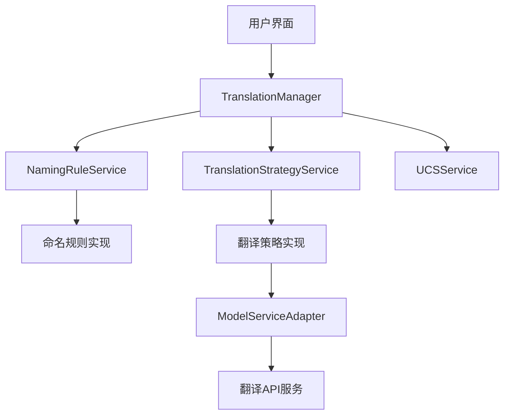

# 音效文件命名规则增强功能开发计划

## 1. 背景与目标

### 1.1 背景

当前的音频翻译器应用程序仅提供单一的命名规则，无法满足不同用户的多样化需求。用户希望能够根据不同场景选择不同的文件命名方式，提高翻译结果的灵活性和适用性。

### 1.2 主要目标

1. **多样化命名规则**：提供多种预定义的命名规则，满足不同场景需求
2. **自定义组合功能**：允许用户自定义组合各种信息形成个性化命名规则
3. **多种翻译策略**：支持不同的翻译处理方式（分词翻译、完整翻译、智能翻译）
4. **特殊处理规则**：对文件扩展名、数字、特殊字符等进行智能处理
5. **架构解耦**：重构现有架构，使命名规则与翻译策略解耦，提高可扩展性
6. **用户友好配置**：提供直观的UI界面配置命名规则和翻译策略

## 2. 当前架构分析

### 2.1 现有组件

当前的翻译功能主要由以下组件实现：

1. **TranslatorService**：负责翻译逻辑和API调用
   - 位于`src/audio_translator/services/business/translator_service.py`
   - 实现文件名翻译、分词处理和API调用
   - 包含翻译缓存管理

2. **UCSService**：负责音效分类管理和翻译辅助
   - 位于`src/audio_translator/services/business/ucs/ucs_service.py`
   - 管理音效分类数据
   - 提供分类查询和猜测功能

3. **FileManagerPanel**：负责文件管理UI
   - 位于`src/audio_translator/gui/panels/file_manager_panel.py`
   - 显示文件列表和翻译结果
   - 处理用户交互和文件操作

### 2.2 当前限制

1. 命名规则和翻译策略高度耦合，难以独立扩展
2. 没有接口抽象，导致功能扩展困难
3. 配置选项有限，用户难以自定义翻译行为
4. 翻译逻辑与UI交互混合，难以测试和维护
5. 缺乏适配不同翻译服务的统一接口

## 3. 需求详细分析

### 3.1 命名规则类型

需要支持以下几种命名规则：

1. **直接翻译模式**
   - 直接使用翻译后的文件名
   - 保留原有格式和词组结构
   - 适合简单快速的翻译需求

2. **双语模式**
   - 原文件名 + 分隔符 + 翻译名称
   - 支持自定义分隔符
   - 适合需要保留原文的场景

3. **自定义模式**
   - 自定义前缀 + 翻译文件名 + 序号
   - 序号支持自定义位数和格式
   - 适合批量处理并需要编号的场景

4. **UCS标准模式**
   - 基于UCS音效分类标准格式化
   - 支持字段组合和顺序调整
   - 适合专业音效整理和分类

### 3.2 翻译策略

需要支持以下翻译策略：

1. **分词翻译**
   - 将文件名分解为词块，单独翻译后重组
   - 保留原始结构和格式
   - 适合专业术语和结构化文件名

2. **完整翻译**
   - 将整个文件名作为一个整体翻译
   - 获取更自然流畅的翻译
   - 适合描述性的文件名

3. **智能翻译**
   - 使用AI分析文件名语义
   - 结合上下文和分类信息优化翻译
   - 适合复杂或专业性强的文件名

### 3.3 特殊处理要求

1. **文件扩展名处理**
   - 识别并保留文件扩展名（如.mp3, .wav）
   - 确保扩展名不被翻译或修改

2. **数字和代码处理**
   - 识别并保留数字、版本号等
   - 保持特殊代码格式不变

3. **路径信息整合**
   - 可选择将文件夹路径信息整合到文件名
   - 支持路径层级选择和格式化

4. **长度限制处理**
   - 处理可能过长的翻译结果
   - 提供截断或缩写选项

## 4. 建议架构设计

### 4.1 核心组件设计



### 4.2 关键接口设计

#### 4.2.1 基础接口与抽象类

1. **ITranslationStrategy** - 翻译策略接口
   ```python
   class ITranslationStrategy(ABC):
       @abstractmethod
       def translate(self, text: str, context: Dict[str, Any] = None) -> str:
           """翻译文本内容"""
           pass
   ```

2. **INamingRule** - 命名规则接口
   ```python
   class INamingRule(ABC):
       @abstractmethod
       def format(self, translation_result: Dict[str, Any]) -> str:
           """格式化翻译结果为文件名"""
           pass
   ```

3. **IModelAdapter** - 模型服务适配器接口
   ```python
   class IModelAdapter(ABC):
       @abstractmethod
       def translate(self, text: str, prompt: str = None) -> str:
           """调用翻译服务API"""
           pass
   ```

### 4.3 服务层设计

#### 4.3.1 TranslationManager

中央协调服务，管理翻译流程和服务协作：

```python
class TranslationManager:
    """翻译管理器，协调翻译策略和命名规则"""
    
    def __init__(self, 
                 ucs_service: UCSService, 
                 config_service: ConfigService):
        # 初始化服务和策略/规则集合
        pass
        
    def set_translation_strategy(self, strategy_name: str) -> bool:
        """设置翻译策略"""
        pass
        
    def set_naming_rule(self, rule_name: str) -> bool:
        """设置命名规则"""
        pass
    
    def translate_filename(self, filename: str, file_path: str = None) -> Dict[str, Any]:
        """翻译文件名并应用当前命名规则"""
        pass
    
    # 其他管理方法...
```

#### 4.3.2 NamingRuleService

管理所有命名规则的实现和配置：

```python
class NamingRuleService:
    """命名规则服务，管理所有命名规则"""
    
    def __init__(self, config_service: ConfigService):
        # 初始化规则集合
        pass
        
    def get_rule(self, rule_name: str) -> Optional[INamingRule]:
        """获取指定名称的命名规则"""
        pass
        
    def create_rule_from_config(self, rule_name: str, config: Dict[str, Any]) -> INamingRule:
        """根据配置创建命名规则"""
        pass
    
    def get_available_rules(self) -> List[str]:
        """获取所有可用命名规则名称"""
        pass
```

#### 4.3.3 TranslationStrategyService

管理翻译策略的实现和配置：

```python
class TranslationStrategyService:
    """翻译策略服务，管理所有翻译策略"""
    
    def __init__(self, config_service: ConfigService, model_service_factory):
        # 初始化策略集合
        pass
        
    def get_strategy(self, strategy_name: str) -> Optional[ITranslationStrategy]:
        """获取指定名称的翻译策略"""
        pass
    
    def get_available_strategies(self) -> List[str]:
        """获取所有可用翻译策略名称"""
        pass
```

### 4.4 具体实现类

#### 4.4.1 命名规则实现

1. **DirectNamingRule** - 直接翻译模式
2. **BilingualNamingRule** - 双语模式
3. **CustomNamingRule** - 自定义模式
4. **UCSNamingRule** - UCS标准模式

#### 4.4.2 翻译策略实现

1. **DirectTranslationStrategy** - 完整翻译策略
2. **TokenizedTranslationStrategy** - 分词翻译策略
3. **AITranslationStrategy** - 智能翻译策略

#### 4.4.3 模型适配器实现

1. **OpenAIModelAdapter** - OpenAI API适配器
2. **AnthropicModelAdapter** - Anthropic API适配器
3. **GeminiModelAdapter** - Google Gemini API适配器

## 5. UI设计

### 5.1 翻译设置对话框

```
+------------------------------------------------------+
|  翻译设置                                    [X]     |
+------------------------------------------------------+
|                                                      |
|  翻译策略: [完整翻译 ▼]                            |
|    ○ 分词翻译 - 将文件名分解为词块分别翻译         |
|    ● 完整翻译 - 将文件名作为整体翻译              |
|    ○ 智能翻译 - 使用AI分析上下文优化翻译          |
|                                                      |
|  命名规则: [UCS标准 ▼]                             |
|    ○ 直接翻译 - 直接使用翻译结果作为文件名         |
|    ○ 双语模式 - 原文件名+翻译结果                  |
|    ○ 自定义模式 - 前缀+翻译+序号                   |
|    ● UCS标准 - 基于UCS分类的标准格式              |
|                                                      |
|  规则参数设置:                                       |
|  +--------------------------------------------------+|
|  |                                                  ||
|  | 模板: {category}-{chinese_name}                 ||
|  |                                                  ||
|  | 可用字段:                                        ||
|  | - {category}: 分类名称                          ||
|  | - {category_id}: 分类ID                         ||
|  | - {english_name}: 英文描述                      ||
|  | - {chinese_name}: 中文描述                      ||
|  | - {original_name}: 原文件名                     ||
|  | - {translated_name}: 翻译后的文件名             ||
|  |                                                  ||
|  +--------------------------------------------------+|
|                                                      |
|  [预览示例] [重置默认]         [取消] [保存设置]     |
+------------------------------------------------------+
```

### 5.2 主界面增强

1. 工具栏添加"翻译设置"按钮
2. 翻译菜单增强:
   - 增加"翻译设置..."菜单项
   - 添加翻译策略快速切换子菜单
   - 添加命名规则快速切换子菜单
3. 状态栏显示当前策略和规则信息

## 6. 实施计划

### 6.1 阶段一：基础框架重构（2周）

1. 创建接口和抽象类
   - 定义`ITranslationStrategy`接口
   - 定义`INamingRule`接口
   - 定义`IModelAdapter`接口

2. 实现基础服务层
   - 创建`TranslationManager`服务
   - 创建`NamingRuleService`服务
   - 创建`TranslationStrategyService`服务

3. 重构现有代码
   - 提取`TranslatorService`中的通用功能
   - 扩展`UCSService`接口以支持新架构
   - 实现Model适配器基类

### 6.2 阶段二：命名规则实现（1周）

1. 实现基本命名规则
   - 实现`DirectNamingRule`
   - 实现`BilingualNamingRule`
   - 实现`CustomNamingRule`
   - 实现`UCSNamingRule`

2. 添加规则配置逻辑
   - 实现规则参数配置管理
   - 添加规则持久化存储
   - 实现规则加载和切换功能

### 6.3 阶段三：翻译策略实现（1周）

1. 实现基本翻译策略
   - 实现`DirectTranslationStrategy`
   - 实现`TokenizedTranslationStrategy`
   - 实现`AITranslationStrategy`

2. 添加策略配置逻辑
   - 实现策略参数配置管理
   - 添加策略持久化存储
   - 实现策略加载和切换功能

### 6.4 阶段四：UI实现（1周）

1. 创建翻译设置对话框
   - 实现策略选择UI
   - 实现规则选择UI
   - 实现参数配置UI

2. 更新主界面
   - 添加设置按钮和菜单项
   - 实现状态显示
   - 整合现有翻译功能

### 6.5 阶段五：测试与优化（1周）

1. 单元测试
   - 测试各种命名规则
   - 测试不同翻译策略
   - 测试模型适配器

2. 集成测试
   - 测试整体翻译流程
   - 测试UI交互
   - 测试异常处理

3. 性能优化
   - 优化翻译流程
   - 添加缓存机制
   - 减少不必要的计算

## 7. 文件结构

建议的项目文件结构：

```
src/audio_translator/
├── services/
│   ├── business/
│   │   ├── translation/
│   │   │   ├── __init__.py
│   │   │   ├── translation_manager.py
│   │   │   ├── interfaces.py
│   │   │   ├── naming_rule_service.py
│   │   │   ├── translation_strategy_service.py
│   │   │   ├── model_service_adapter.py
│   │   │   ├── rules/
│   │   │   │   ├── __init__.py
│   │   │   │   ├── direct_naming_rule.py
│   │   │   │   ├── bilingual_naming_rule.py
│   │   │   │   ├── custom_naming_rule.py
│   │   │   │   └── ucs_naming_rule.py
│   │   │   └── strategies/
│   │   │       ├── __init__.py
│   │   │       ├── direct_translation_strategy.py
│   │   │       ├── tokenized_translation_strategy.py
│   │   │       └── ai_translation_strategy.py
│   │   ├── translator_service.py  # 保留作为向后兼容
│   │   └── ucs/
│   │       └── ucs_service.py
│   └── api/
│       ├── __init__.py
│       ├── model_service.py
│       └── providers/
│           ├── __init__.py
│           ├── openai/
│           │   └── openai_adapter.py
│           ├── anthropic/
│           │   └── anthropic_adapter.py
│           └── gemini/
│               └── gemini_adapter.py
├── gui/
│   ├── dialogs/
│   │   ├── __init__.py
│   │   └── translation_settings_dialog.py
│   └── panels/
│       └── file_manager_panel.py
```

## 8. 测试计划

### 8.1 单元测试

1. 命名规则测试
   - 测试每种规则的格式化逻辑
   - 测试异常输入处理
   - 测试边界条件

2. 翻译策略测试
   - 测试每种策略的翻译逻辑
   - 测试分词和重组功能
   - 测试上下文处理能力

3. 模型适配器测试
   - 测试API调用逻辑
   - 测试错误处理
   - 测试重试机制

### 8.2 集成测试

1. 翻译流程测试
   - 测试不同策略和规则组合
   - 测试特殊字符和长度处理
   - 测试批量处理性能

2. UI交互测试
   - 测试设置对话框功能
   - 测试配置保存和加载
   - 测试预览功能

### 8.3 性能测试

1. 大量文件处理测试
   - 测试500+文件的翻译性能
   - 测试内存占用
   - 测试UI响应性

2. API调用优化测试
   - 测试批量请求性能
   - 测试缓存命中率
   - 测试网络延迟处理

## 9. 风险与缓解策略

1. **风险**: 架构重构可能引入兼容性问题
   - **缓解**: 保留原有接口，确保向后兼容

2. **风险**: 命名规则复杂度导致用户混淆
   - **缓解**: 提供清晰的文档和UI说明，添加预览功能

3. **风险**: 翻译API限制和成本
   - **缓解**: 实现智能缓存和批量处理，减少API调用

4. **风险**: 特殊文件名处理异常
   - **缓解**: 全面的异常处理和日志记录，提供手动修复选项

## 10. 参考资源

1. 现有代码:
   - `src/audio_translator/services/business/translator_service.py`
   - `src/audio_translator/services/business/ucs/ucs_service.py`
   - `src/audio_translator/gui/panels/file_manager_panel.py`

2. 相关文档:
   - [docs/next_steps.md](/docs/next_steps.md)
   - [docs/file_management_enhancement_plan.md](/docs/file_management_enhancement_plan.md)
   - [docs/async_processing_optimization.md](/docs/async_processing_optimization.md)

3. 设计模式参考:
   - 策略模式 (翻译策略)
   - 适配器模式 (API接口适配)
   - 工厂模式 (规则和策略创建)
   - 命令模式 (翻译操作)