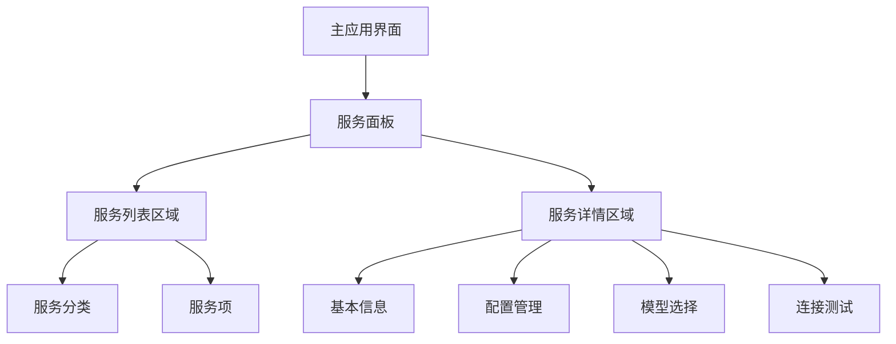

# 服务面板与模型管理集成规划

## 背景与目标

当前项目的服务管理和模型配置是通过独立对话框实现的，参考 Cherry Studio 项目的设计，我们计划将这些功能集成到主界面的服务面板中，以提供更好的用户体验和更紧密的功能整合。

## 集成架构图

## 阶段性实施计划

### 第一阶段：基础架构改进

1. 完善服务管理对话框的错误处理和用户体验
   - 优化错误处理，增加用户反馈
   - 完善UI布局和交互
   - 支持配置文件的自动恢复

2. 增强配置服务
   - 增加配置热重载功能
   - 完善配置读写的错误处理
   - 添加配置变更事件系统

### 第二阶段：服务面板设计和实现

1. 设计服务面板UI组件
   - 创建 ServicePanel 类，继承自 ttk.Frame
   - 实现服务列表区域
   - 实现服务详情区域
   - 设计服务项卡片组件

2. 服务数据管理
   - 服务注册和状态管理
   - 服务事件系统
   - 服务配置读写

### 第三阶段：功能集成

1. 模型管理集成
   - 将现有模型管理功能移植到服务面板
   - 实现模型选择和配置界面
   - 添加模型热切换功能

2. 服务测试集成
   - 在服务面板中添加测试功能
   - 提供直观的测试结果展示
   - 增加服务健康检查功能

### 第四阶段：优化和扩展

1. 性能优化
   - 加载性能优化
   - 内存使用优化
   - 异步处理优化

2. 功能扩展
   - 支持更多服务类型
   - 增加服务分组功能
   - 添加服务统计和使用报告

## 用户体验目标

1. 减少弹窗跳转，提供更统一的管理界面
2. 简化配置流程，降低用户配置难度
3. 提供更直观的服务状态反馈
4. 支持快速切换不同服务和模型

## 预期风险和缓解策略

1. 集成可能导致界面过于复杂
   - 使用分页或折叠面板降低视觉复杂度
   - 提供简洁模式和高级模式切换

2. 服务配置变更可能影响系统稳定性
   - 增加配置变更验证机制
   - 提供配置回滚功能
   - 加入变更日志记录

3. 不同服务需要不同配置界面
   - 实现可插拔的配置面板系统
   - 根据服务类型自动加载对应配置界面

## 实施时间线

| 阶段 | 预计开始时间 | 预计完成时间 | 关键里程碑 |
|------|------------|------------|----------|
| 第一阶段 | 立即 | 2周内 | 配置服务改进完成 |
| 第二阶段 | 3周后 | 5周后 | 服务面板基础功能实现 |
| 第三阶段 | 6周后 | 8周后 | 模型管理集成完成 |
| 第四阶段 | 9周后 | 12周后 | 优化和扩展完成 |

## 技术选型

1. 用户界面：Tkinter + ttk（现有框架）
2. 配置管理：JSON + 环境变量（现有方式）
3. 事件系统：自定义事件系统，支持观察者模式
4. 组件架构：采用 MVC 模式进行面板设计 