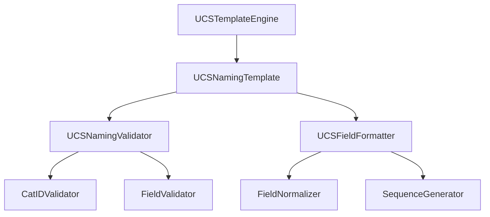

# UCS音效文件命名规则增强计划

## 1. UCS命名标准概述

### 1.1 核心结构
UCS（Universal Category System）是一个专业的音效分类系统，包含：
- 82个主分类
- 657个子分类
- 标准化的CatID格式

### 1.2 基础命名格式
```
CatID_FXName[_FXName_zh][_CreatorID][_SourceID]_[CustomSequence]
```

组件说明：
- **CatID**: 必需，格式为`[A-Z]{3}[0-9]{3}`
- **FXName**: 必需，简短的英文描述
- **FXName_zh**: 可选，中文描述
- **CreatorID**: 可选，创作者ID
- **SourceID**: 可选，来源ID
- **CustomSequence**: 可选，自定义序号

## 2. 增强功能设计

### 2.1 UCS模板引擎


### 2.2 核心组件

#### 2.2.1 UCSTemplateEngine
```python
class UCSTemplateEngine:
    """UCS命名模板引擎，处理模板解析和渲染"""
    
    def __init__(self, config: Dict[str, Any] = None):
        self.config = config or {}
        self.templates = {}
        self.validator = UCSNamingValidator()
        self.formatter = UCSFieldFormatter()
    
    def register_template(self, name: str, template: UCSNamingTemplate):
        """注册UCS命名模板"""
        if self.validator.validate_template(template):
            self.templates[name] = template
    
    def render(self, template_name: str, context: Dict[str, Any]) -> str:
        """渲染UCS文件名"""
        template = self.templates.get(template_name)
        if not template:
            raise ValueError(f"Template {template_name} not found")
        
        # 验证必需字段
        if not self.validator.validate_context(context):
            raise ValueError("Missing required UCS fields")
        
        # 格式化字段
        formatted_fields = self.formatter.format_fields(context)
        
        # 渲染模板
        return template.render(formatted_fields)
```

#### 2.2.2 UCSNamingTemplate
```python
class UCSNamingTemplate:
    """UCS命名模板定义和渲染"""
    
    def __init__(self, template_str: str, config: Dict[str, Any] = None):
        self.template_str = template_str
        self.config = config or {}
        self.required_fields = ['cat_id', 'fx_name']
        self.optional_fields = ['fx_name_zh', 'creator_id', 'source_id', 'sequence']
        self.field_order = self._parse_field_order()
    
    def _parse_field_order(self) -> List[str]:
        """解析字段顺序"""
        # 实现字段顺序解析逻辑
        pass
    
    def render(self, context: Dict[str, Any]) -> str:
        """渲染UCS文件名"""
        parts = []
        for field in self.field_order:
            if field in self.required_fields or field in context:
                value = context.get(field, '')
                if value:
                    parts.append(str(value))
        return '_'.join(parts)
```

#### 2.2.3 UCSNamingValidator
```python
class UCSNamingValidator:
    """UCS命名规则验证器"""
    
    def __init__(self):
        self.cat_id_pattern = re.compile(r'^[A-Z]{3}[0-9]{3}$')
    
    def validate_cat_id(self, cat_id: str) -> bool:
        """验证CatID格式"""
        return bool(self.cat_id_pattern.match(cat_id))
    
    def validate_template(self, template: UCSNamingTemplate) -> bool:
        """验证模板配置"""
        # 验证必需字段是否存在
        required_fields = set(template.required_fields)
        template_fields = set(template.field_order)
        return required_fields.issubset(template_fields)
    
    def validate_context(self, context: Dict[str, Any]) -> bool:
        """验证上下文数据"""
        # 验证必需字段
        if not all(field in context for field in ['cat_id', 'fx_name']):
            return False
        
        # 验证CatID格式
        if not self.validate_cat_id(context['cat_id']):
            return False
        
        return True
```

#### 2.2.4 UCSFieldFormatter
```python
class UCSFieldFormatter:
    """UCS字段格式化处理器"""
    
    def __init__(self, config: Dict[str, Any] = None):
        self.config = config or {}
        self.normalizer = FieldNormalizer()
        self.sequence_generator = SequenceGenerator()
    
    def format_fields(self, context: Dict[str, Any]) -> Dict[str, Any]:
        """格式化所有字段"""
        formatted = {}
        
        # 格式化CatID
        if 'cat_id' in context:
            formatted['cat_id'] = context['cat_id'].upper()
        
        # 格式化FXName
        if 'fx_name' in context:
            formatted['fx_name'] = self.normalizer.normalize_fx_name(
                context['fx_name']
            )
        
        # 格式化可选字段
        optional_fields = ['fx_name_zh', 'creator_id', 'source_id']
        for field in optional_fields:
            if field in context:
                formatted[field] = self.normalizer.normalize_field(
                    context[field], field
                )
        
        # 生成序号
        if 'sequence' in context:
            formatted['sequence'] = self.sequence_generator.generate(
                context['sequence']
            )
        
        return formatted
```

## 3. 配置系统

### 3.1 模板配置示例
```yaml
ucs_templates:
  default:
    template: "{cat_id}_{fx_name}"
    required_fields: ["cat_id", "fx_name"]
  
  full:
    template: "{cat_id}_{fx_name}_{fx_name_zh}_{creator_id}_{source_id}_{sequence}"
    required_fields: ["cat_id", "fx_name"]
    optional_fields: ["fx_name_zh", "creator_id", "source_id", "sequence"]
    sequence_format:
      padding: 3
      prefix: ""
      start: 1
  
  custom:
    template: "{cat_id}_{fx_name}_{custom_fields}"
    required_fields: ["cat_id", "fx_name"]
    custom_fields:
      enabled: true
      separator: "_"
      order: ["fx_name_zh", "creator_id", "source_id", "sequence"]
```

### 3.2 字段验证规则
```yaml
field_validation:
  cat_id:
    pattern: "^[A-Z]{3}[0-9]{3}$"
    required: true
  
  fx_name:
    max_length: 50
    required: true
    normalize: true
  
  fx_name_zh:
    max_length: 50
    required: false
    normalize: true
  
  creator_id:
    pattern: "^[A-Za-z0-9_-]{3,20}$"
    required: false
  
  source_id:
    pattern: "^[A-Za-z0-9_-]{3,20}$"
    required: false
  
  sequence:
    pattern: "^[0-9]+$"
    required: false
    format:
      padding: 3
      prefix: ""
```

## 4. 使用示例

### 4.1 基础用法
```python
# 创建UCS模板引擎
engine = UCSTemplateEngine()

# 注册模板
template = UCSNamingTemplate("{cat_id}_{fx_name}_{fx_name_zh}")
engine.register_template("basic", template)

# 使用模板
context = {
    "cat_id": "AMB001",
    "fx_name": "forest_morning",
    "fx_name_zh": "森林清晨"
}
filename = engine.render("basic", context)
# 输出: AMB001_forest_morning_森林清晨
```

### 4.2 高级用法
```python
# 使用完整模板
template = UCSNamingTemplate(
    "{cat_id}_{fx_name}_{fx_name_zh}_{creator_id}_{source_id}_{sequence}"
)
engine.register_template("full", template)

# 使用所有字段
context = {
    "cat_id": "AMB001",
    "fx_name": "forest_morning",
    "fx_name_zh": "森林清晨",
    "creator_id": "studio_a",
    "source_id": "lib_001",
    "sequence": 1
}
filename = engine.render("full", context)
# 输出: AMB001_forest_morning_森林清晨_studio_a_lib_001_001
```

## 5. 实现注意事项

### 5.1 性能优化
1. 模板缓存
2. 正则表达式预编译
3. 字段验证优化
4. 序号生成器优化

### 5.2 错误处理
1. 输入验证
2. 格式化异常
3. 模板解析错误
4. 字段验证失败

### 5.3 扩展性考虑
1. 自定义字段支持
2. 模板继承机制
3. 插件系统
4. 多语言支持

## 6. 后续优化方向

1. 批量处理优化
2. 智能分类建议
3. 模板管理界面
4. 导入导出功能
5. 统计分析功能